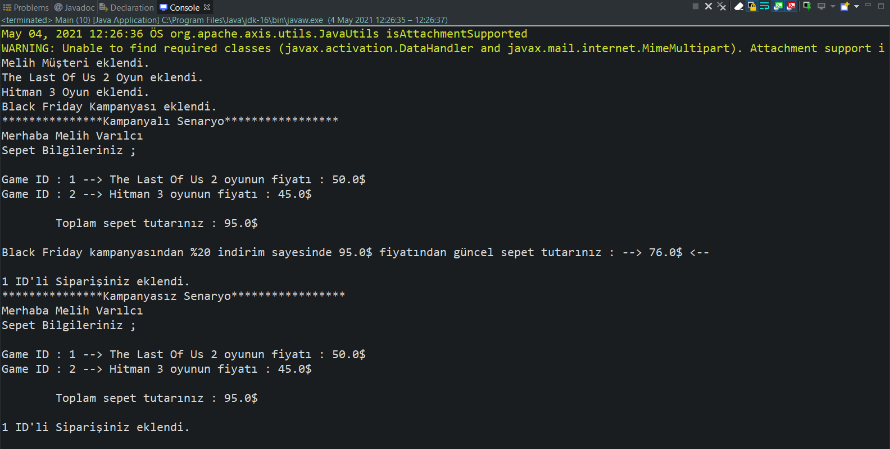
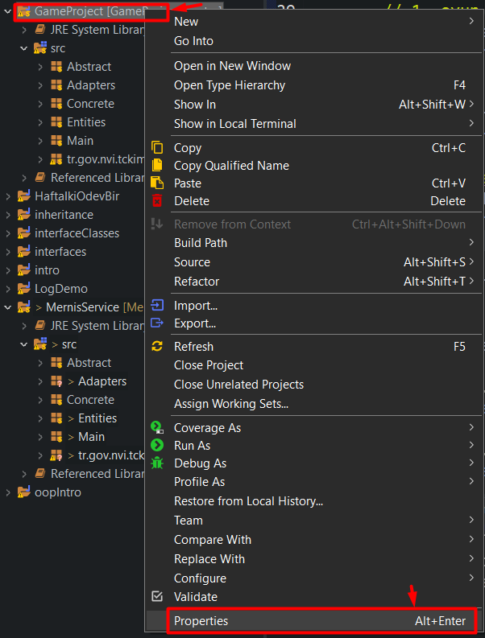
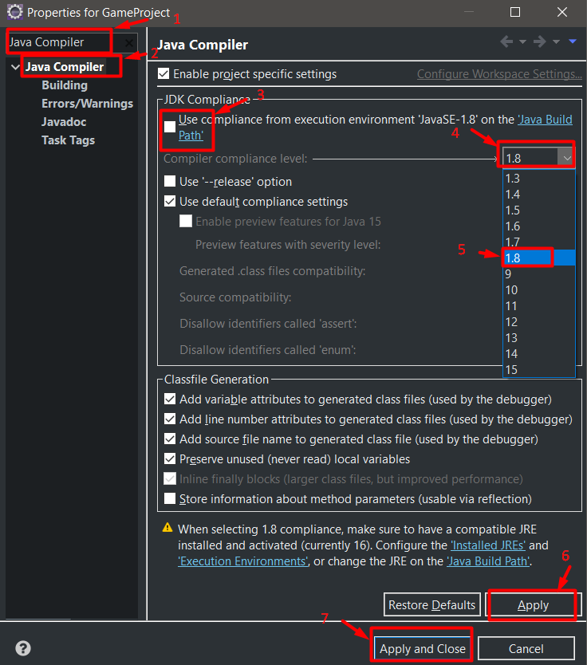
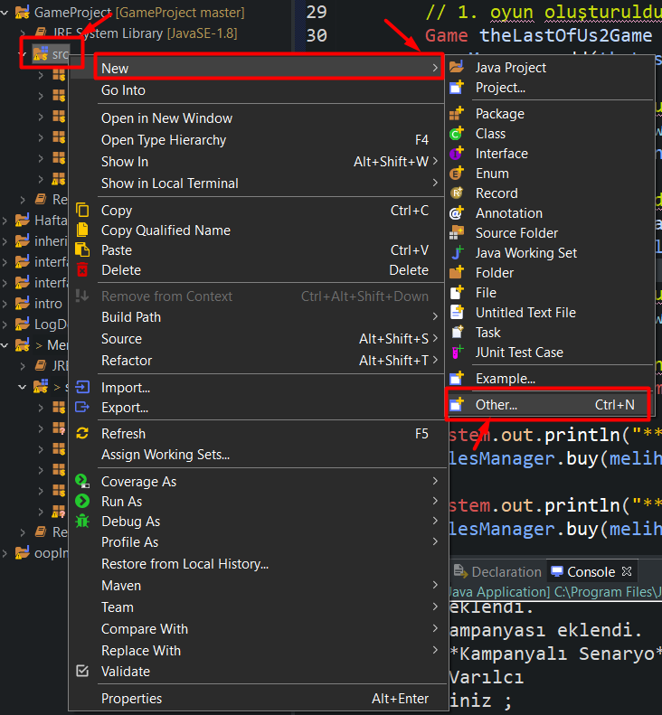
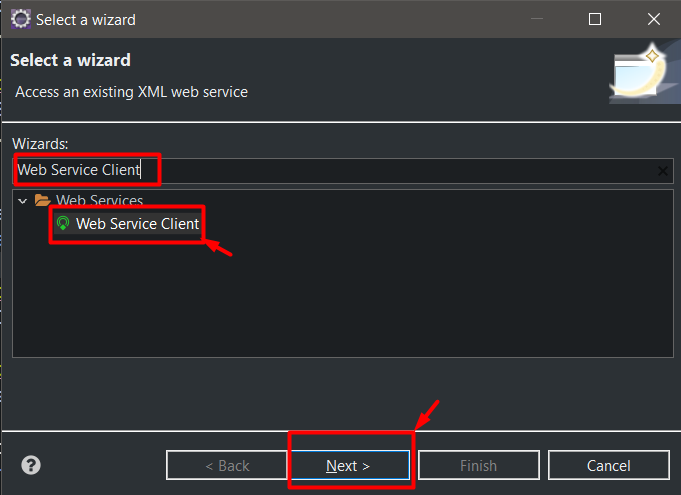
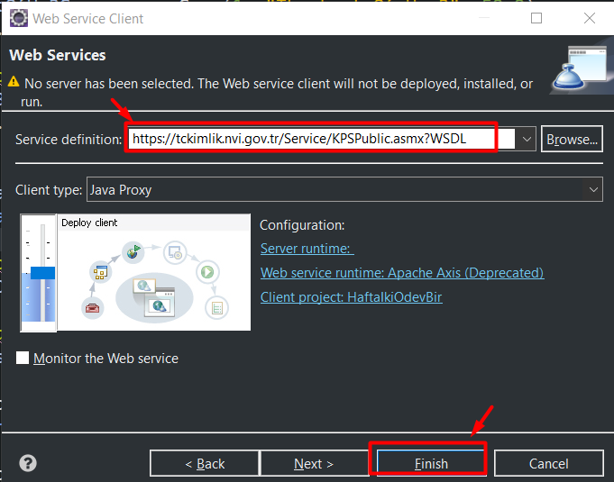

# Game Project - Java Console Çıktıları

- Mernis Servisi kullanılarak müşteri kaydı.
- Sepete eklenen oyunlar.
- Sepet toplam fiyatına uygulananabilecek kampanya kodu senaryosu ve kampanyaların olmadığı bir senaryo uygulanmıştır.

>

* * *

# **MERNİS** ( Kimlik Doğrulama Servisi ) Projeye Ekleme

1. İlk olarak oluşturduğumuz projenin compiler sürümünü kontrol edelim;
>

* * *

2. Arama kısmına "Java Compiler" yazarak kolayca erişebilirsiniz, "Java Compiler" yazısını seçip belirtilen adımları uygulayın.
>

* * *

3. Project compiler sürümünü kontrol ettikten sonra, çalıştığımız projeye Mernis configürasyonuna başlayalım.
>

* * *

4. Wizards: kısmına "Web Service Client" yazarak kolayca erişim sağlayabilirsiniz.
>

* * *

5. Service definition: kısmına [https://tckimlik.nvi.gov.tr/Service/KPSPublic.asmx?WSDL](https://tckimlik.nvi.gov.tr/Service/KPSPublic.asmx?WSDL) adresini yapıştırıyoruz ve "Finish" butonuna basıyoruz.
>